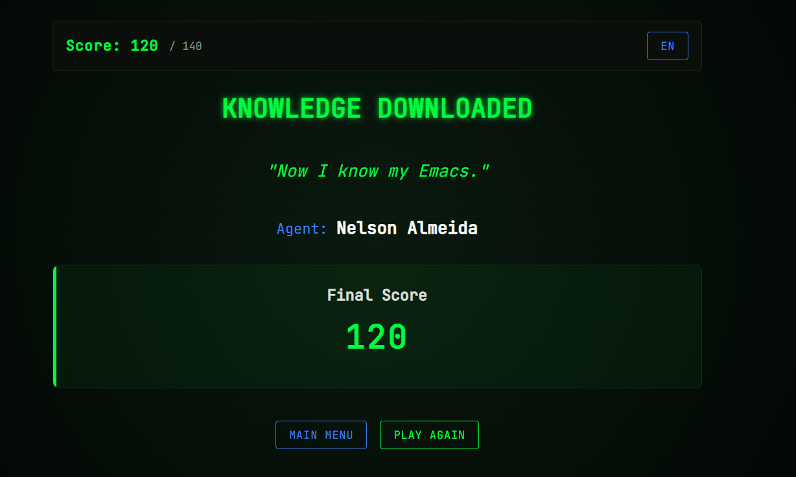
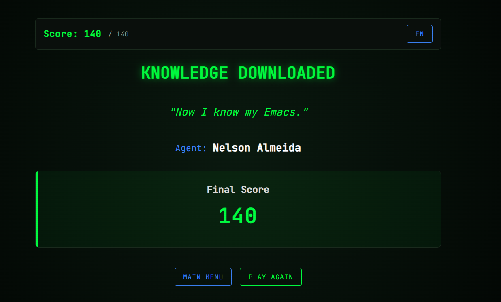
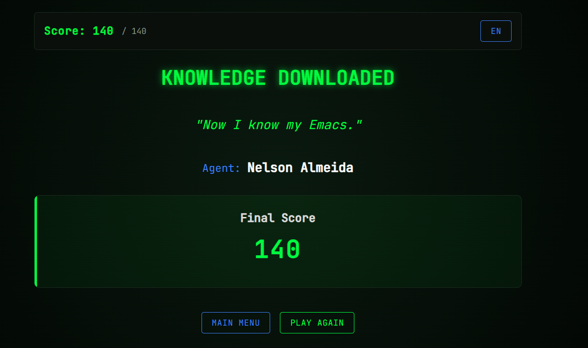
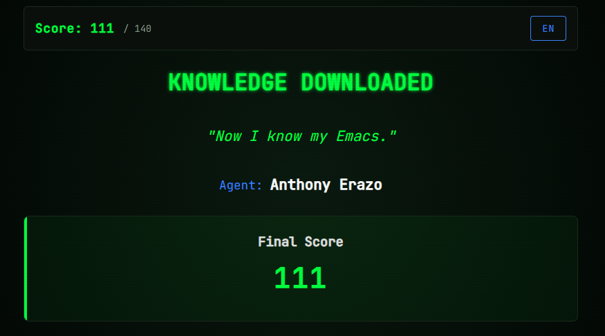
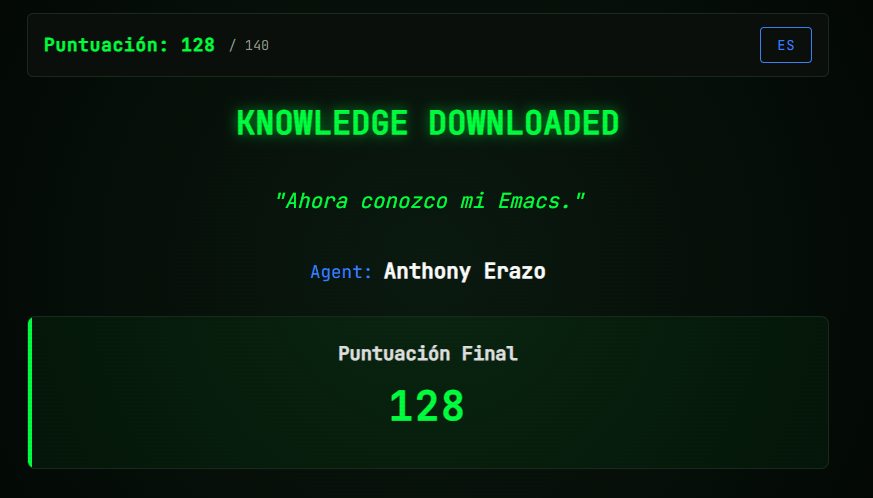
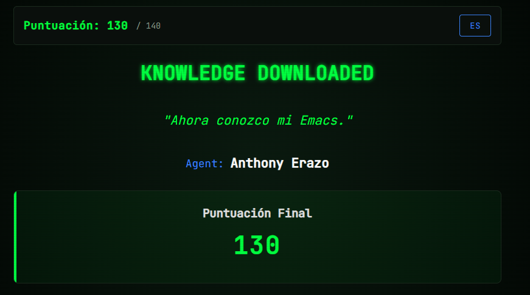
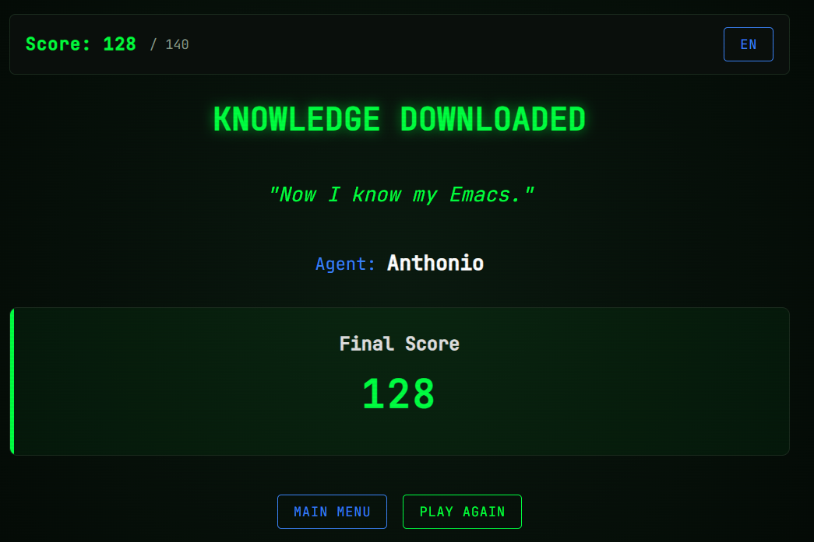
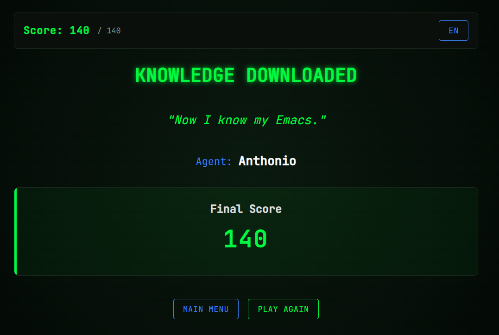

#+options: ':nil *:t -:t ::t <:t H:3 \n:nil ^:t arch:headline
#+options: author:t broken-links:nil c:nil creator:nil
#+options: d:(not "LOGBOOK") date:t e:t email:nil expand-links:t f:t
#+options: inline:t num:t p:nil pri:nil prop:nil stat:t tags:t
#+options: tasks:t tex:t timestamp:t title:t toc:nil todo:t |:t
#+title: Taller de Configuración de Entorno WSL
#+date: <2026-04-19> 
#+author: Anthonny Almeida, Nelson Almeida,Anthony Erazo
#+email:anthonny.almeida@epn.edu.ec, nelson.almeida@epn.edu.ec, anthony.erazo01@epn.edu.ec
#+language: Espanol
#+select_tags: export
#+exclude_tags: noexport
#+creator: Emacs 27.1 (Org mode 9.7.5)
#+cite_export:

#+latex_class: article
#+latex_class_options:
#+latex_header:
#+latex_header_extra:
#+description:
#+keywords:
#+subtitle:
#+latex_footnote_command: \footnote{%s%s}
#+latex_engraved_theme:
#+latex_compiler: pdflatex

#+latex_header: \usepackage{fancyhdr}
#+latex_header: \usepackage[top=25mm, left=25mm, right=25mm]{geometry}
#+latex_header: \usepackage{longtable}
#+latex_header: \fancyhead[R]{}
#+latex_header: \setlength\headheight{43.0pt}
#+LATEX_HEADER: \usepackage{tabularx}
#+LATEX_HEADER: \usepackage{longtable}

#+begin_export latex
\fancyhead[C]{\includegraphics[scale=0.05]{./images/logoEpn.jpg}\\
ESCUELA POLITÉCNICA NACIONAL\\FACULTAD DE INGENIERÍA DE SISTEMAS\\
ARQUITECTURA DE COMPUTADORES}
\thispagestyle{fancy}
#+end_export

* Objetivos

- Configurar y validar el entorno de trabajo para la asignatura de Arquitectura de Computadores en Linux o WSL.
- Verificar la instalación de herramientas base: mamba/anaconda (Python), Emacs y \LaTeX.
- Documentar evidencias tecnicas mediante capturas y comandos ejecutados.

* Instrucciones

1. Realice todas las actividades en Linux o en WSL.
2. En cada sección ejecute los comandos solicitados y registre la salida en el bloque correspondiente.
3. Guarde el archivo y exporte a pdf con el comando `org-latex-export-to-pdf`.
4. Verifique que estén todos los nombres de los integrantes del grupo
   de trabajo. Los grupos para este trabajo están en [[https://epnecuador.sharepoint.com/:x:/s/ICCD332-ArquitecturaComputadores/IQCjNuELSDbJTb42EfrLL2ksATBSbitbZ9_iFLJxIiCtSr0?e=gowv5I][Equipos de Trabajo]].
5. Verifique que en las distintas secciones de este archivo esté
   identificado con nombre e email el aporte del estudiante.

Si requiere insertar una imagen, crear una carpeta ~images~ y colocar
la imagen dentro. Para llamar la imagen desde Emacs use ~C-c C-l~ y
busque el archivo o escriba:Puede insertar una imagen con la sintaxis:

#+begin_src org
[[./images/image1.jpg]]
#+end_src
* Actividades
** Configuración de WSL con Ubuntu, \LaTeX, Python e Emacs
 
1. Verificación de entorno mamba/anaconda
   1. Active WSL (si aplica) y su entorno de trabajo.
   2. Ejecute ~mamba info~ con ~C-c C-c~ dentro del bloque de código.
   3. Si el comando falla, active un entorno con ~mamba activate iccd332~ e intente de nuevo.  

*** Estudiante B: Nelson Almeida
#+begin_src shell :exports both :results verbatim
     mamba info
   #+end_src

   #+RESULTS:
   #+begin_example

	  libmamba version : 2.5.0
	     mamba version : 2.5.0
	      curl version : libcurl/8.19.0 OpenSSL/3.6.1 zlib/1.3.2 zstd/1.5.7 libssh2/1.11.1 nghttp2/1.68.1 mit-krb5/1.22.2
	libarchive version : libarchive 3.8.6 zlib/1.3.2 liblzma/5.8.2 bz2lib/1.0.8 liblz4/1.10.0 libzstd/1.5.7 liblzo2/2.10 openssl/3.5.5 libb2/bundled
	  envs directories : /home/josueal-epn/miniforge3/envs
	     package cache : /home/josueal-epn/miniforge3/pkgs
			     /home/josueal-epn/.mamba/pkgs
	       environment : iccd332 (active)
	      env location : /home/josueal-epn/miniforge3/envs/iccd332
	 user config files : /home/josueal-epn/.mambarc
    populated config files : /home/josueal-epn/miniforge3/.condarc
	  virtual packages : __unix=0=0
			     __linux=6.6.87=0
			     __glibc=2.39=0
			     __archspec=1=x86_64_v3
			     __cuda=13.1=0
		  channels : https://conda.anaconda.org/conda-forge/linux-64
			     https://conda.anaconda.org/conda-forge/noarch
	  base environment : /home/josueal-epn/miniforge3
		  platform : linux-64
   #+end_example

*** Estudiante C: Anthony Erazo
#+begin_src shell :exports both :results verbatim
     mamba info
   #+end_src

   #+RESULTS:
   #+begin_example

	  libmamba version : 2.5.0
	     mamba version : 2.5.0
	      curl version : libcurl/8.19.0 OpenSSL/3.6.1 zlib/1.3.2 zstd/1.5.7 libssh2/1.11.1 nghttp2/1.68.1 mit-krb5/1.22.2
	libarchive version : libarchive 3.8.6 zlib/1.3.2 liblzma/5.8.2 bz2lib/1.0.8 liblz4/1.10.0 libzstd/1.5.7 liblzo2/2.10 openssl/3.5.5 libb2/bundled
	  envs directories : /home/anthony-el/.local/share/mamba/envs
	     package cache : /home/anthony-el/.local/share/mamba/pkgs
			     /home/anthony-el/.mamba/pkgs
	       environment : iccd332 (active)
	      env location : /home/anthony-el/.local/share/mamba/envs/iccd332
	 user config files : /home/anthony-el/.mambarc
    populated config files : 
	  virtual packages : __unix=0=0
			     __linux=6.6.87=0
			     __glibc=2.39=0
			     __archspec=1=x86_64_v3
		  channels : https://conda.anaconda.org/conda-forge/linux-64
			     https://conda.anaconda.org/conda-forge/noarch
	  base environment : /home/anthony-el/.local/share/mamba
		  platform : linux-64
   #+end_example

*** Estudiante D: Anthonny Almeida

   #+begin_src shell :exports both :results verbatim
     mamba info
   #+end_src
  
   #+RESULTS:
   #+begin_example

	  libmamba version : 2.5.0
	     mamba version : 2.5.0
	      curl version : libcurl/8.19.0 OpenSSL/3.6.1 zlib/1.3.2 zstd/1.5.7 libssh2/1.11.1 nghttp2/1.68.1 mit-krb5/1.22.2
	libarchive version : libarchive 3.8.6 zlib/1.3.2 liblzma/5.8.2 bz2lib/1.0.8 liblz4/1.10.0 libzstd/1.5.7 liblzo2/2.10 openssl/3.5.5 libb2/bundled
	  envs directories : /home/anthonio/miniforge3/envs
	     package cache : /home/anthonio/miniforge3/pkgs
			     /home/anthonio/.mamba/pkgs
	       environment : iccd332 (active)
	      env location : /home/anthonio/miniforge3/envs/iccd332
	 user config files : /home/anthonio/.mambarc
    populated config files : /home/anthonio/miniforge3/.condarc
	  virtual packages : __unix=0=0
			     __linux=6.6.87=0
			     __glibc=2.42=0
			     __archspec=1=x86_64_v4
		  channels : https://conda.anaconda.org/conda-forge/linux-64
			     https://conda.anaconda.org/conda-forge/noarch
	  base environment : /home/anthonio/miniforge3
		  platform : linux-64
   #+end_example

2. Verificación de Python
   1. Active el entorno ~iccd332~ para abrir Emacs con ~mamba activate iccd332~.
   2. Ejecute ~python --version~ en la consola y desde Emacs.

*** Estudiante B: Nelson Almeida

   #+begin_src shell :exports both :results verbatim
    python --version
   #+end_src

   #+RESULTS:
   : Python 3.11.15
*** Estudiante C: Anthony Erazo
 #+begin_src shell :exports both :results verbatim
    python --version
   #+end_src

   #+RESULTS:
   : Python 3.14.4

*** Estudiante D: Anthonny Almeida

   #+begin_src shell :exports both :results verbatim
    python --version
   #+end_src

   #+RESULTS:
   : Python 3.14.4

3. Verificación de Emacs
   Ejecute ~emacs --version~ en la consola y desde Emacs.

*** Estudiante B: Nelson Almeida

   #+begin_src shell :exports both :results verbatim
   emacs --version
   #+end_src

   #+RESULTS:
   : GNU Emacs 29.3
   : Copyright (C) 2024 Free Software Foundation, Inc.
   : GNU Emacs comes with ABSOLUTELY NO WARRANTY.
   : You may redistribute copies of GNU Emacs
   : under the terms of the GNU General Public License.
   : For more information about these matters, see the file named COPYING.
*** Estudiante C: Anthony Erazo

   #+begin_src shell :exports both :results verbatim
   emacs --version
   #+end_src

   #+RESULTS:
   : GNU Emacs 29.3
   : Copyright (C) 2024 Free Software Foundation, Inc.
   : GNU Emacs comes with ABSOLUTELY NO WARRANTY.
   : You may redistribute copies of GNU Emacs
   : under the terms of the GNU General Public License.
   : For more information about these matters, see the file named COPYING.
   
*** Estudiante D: Anthonny Almeida

   #+begin_src shell :exports both :results verbatim
   emacs --version
   #+end_src

   #+RESULTS:
   : GNU Emacs 30.2
   : Copyright (C) 2025 Free Software Foundation, Inc.
   : GNU Emacs comes with ABSOLUTELY NO WARRANTY.
   : You may redistribute copies of GNU Emacs
   : under the terms of the GNU General Public License.
   : For more information about these matters, see the file named COPYING.

4. Verificación de LaTeX
   Ejecute ~latex --version~ en la consola y desde Emacs.

*** Estudiante B: Nelson Almeida

   #+begin_src shell :exports both :results verbatim
   latex --version
   #+end_src

   #+RESULTS:
   #+begin_example
   pdfTeX 3.141592653-2.6-1.40.25 (TeX Live 2023/Debian)
   kpathsea version 6.3.5
   Copyright 2023 Han The Thanh (pdfTeX) et al.
   There is NO warranty.  Redistribution of this software is
   covered by the terms of both the pdfTeX copyright and
   the Lesser GNU General Public License.
   For more information about these matters, see the file
   named COPYING and the pdfTeX source.
   Primary author of pdfTeX: Han The Thanh (pdfTeX) et al.
   Compiled with libpng 1.6.43; using libpng 1.6.43
   Compiled with zlib 1.3; using zlib 1.3
   Compiled with xpdf version 4.04
   #+end_example
*** Estudiante C: Anthony Erazo   
 #+begin_src shell :exports both :results verbatim
   latex --version
   #+end_src

   #+RESULTS:
   #+begin_example
   pdfTeX 3.141592653-2.6-1.40.25 (TeX Live 2023/Debian)
   kpathsea version 6.3.5
   Copyright 2023 Han The Thanh (pdfTeX) et al.
   There is NO warranty.  Redistribution of this software is
   covered by the terms of both the pdfTeX copyright and
   the Lesser GNU General Public License.
   For more information about these matters, see the file
   named COPYING and the pdfTeX source.
   Primary author of pdfTeX: Han The Thanh (pdfTeX) et al.
   Compiled with libpng 1.6.43; using libpng 1.6.43
   Compiled with zlib 1.3; using zlib 1.3
   Compiled with xpdf version 4.04
   #+end_example

*** Estudiante D: Anthonny Almeida

   #+begin_src shell :exports both :results verbatim
   latex --version
   #+end_src

   #+RESULTS:
   #+begin_example
   pdfTeX 3.141592653-2.6-1.40.28 (TeX Live 2025/Debian)
   kpathsea version 6.4.1
   Copyright 2025 Han The Thanh (pdfTeX) et al.
   There is NO warranty.  Redistribution of this software is
   covered by the terms of both the pdfTeX copyright and
   the Lesser GNU General Public License.
   For more information about these matters, see the file
   named COPYING and the pdfTeX source.
   Primary author of pdfTeX: Han The Thanh (pdfTeX) et al.
   Compiled with libpng 1.6.55; using libpng 1.6.55
   Compiled with zlib 1.3.1; using zlib 1.3.1
   Compiled with xpdf version 4.04
   #+end_example

5. Registro de problemas y solución aplicada

Complete la siguiente tabla si tuvo errores durante la configuración:

#+ATTR_LATEX: :environment tabularx :width \textwidth :align lXX
| *Herramienta* | *Problema observado* | *Solución aplicada* |
|---------------+----------------------+---------------------|
|               |                      |                     |
|               |                      |                     |
|               |                      |                     |

** Comandos Emacs Tutorial
Seguir el tutorial integrado en Emacs al respecto de la navegación y
operaciones más frecuentes. El tutorial puede ser accedido en Español
utilizando el comando:
#+begin_src emacs-lisp
M-x help-with-tutorial-spec-language
#+end_src

Realice los ejercicios del tutorial (al menos un 80% del texto) y
complete la siguiente tabla con los comandos que considere de mayor
interés. Verifique que en la parte superior se active el menú de
tabla. Dentro de la región de la tabla puede dar C-c C-c para alinear
automáticamente la tabla al contenido del texto que escriba. Para
generar una nueva fila escriba presione la tecla TAB

<Nelson Almeida>
#+ATTR_LATEX: :environment longtable :align |p{0.2\linewidth}|p{0.3\linewidth}|p{0.2\linewidth}|p{0.3\linewidth}|
| *Comando* | *Descripción*                 | *Comando* | *Descripción*                    |
|-----------+-------------------------------+-----------+----------------------------------|
| ~C-p~     | Mover a la línea anterior     | ~C-n~     | Mover a la línea siguiente       |
| ~C-a~     | Ir al inicio de la línea      | ~C-g~     | Cancelar comando                 |
| ~C-v~     | Avanzar una pantalla completa | ~M->~     | Saltar al puro final del archivo |
| ~C-k~     | Cortar línea                  | ~C-x C-f~ | Encontrar/Abrir un archivo       |

<Anthony Erazo>
#+ATTR_LATEX: :environment longtable :align |p{0.2\linewidth}|p{0.3\linewidth}|p{0.2\linewidth}|p{0.3\linewidth}|
| *Comando* | *Descripción*             | *Comando* | *Descripción*                |
|-----------+---------------------------+-----------+------------------------------|
| ~C-l~     | Encontrar el cursor       | ~C-v~     | Avanzar en la pantalla       |
| ~C-x C-s~ | Guardar los cambios       | ~C-g~     | Cancelar cualquier operación |
| ~C-x C-c~ | Salir de emacs            | ~C-y~     | Pegar texto copiado          |
| ~C-x C-f~ | Abrir o buscar un archivo | ~M-w~     | Copiar texto                 |

<Almeida Anthonny>
#+ATTR_LATEX: :environment longtable :align |p{0.2\linewidth}|p{0.3\linewidth}|p{0.2\linewidth}|p{0.3\linewidth}|
| *Comando*         | *Descripción*               | *Comando*   | *Descripción*                     |
|-------------------+-----------------------------+-------------+-----------------------------------|
| ~C-x C-f # latex~ | Abrir Archivo(find-file)    | ~C-x C-s~   | Guardar los cambios en el archivo |
| ~C-g~             | Cancelar comando            | ~C-d~       | Borrar Carácter                   |
| ~M-d~             | Borrar la palabra siguiente | ~M-w~       | Copiar Región                     |
| ~C-y~             | Pegar                       | ~C-/ o C-_~ | Deshacer                          |
** Comandos Emacs Juego
En la anterior sección usted revisó los comandos de mayor interés
sobre la manipulación de Emacs. Es hora de poner en práctica sus
conocimientos. Realice unas 3 visitas al juego  [[https://chat.qwen.ai/s/deploy/t_23ff57ef-b59a-4bd7-9b79-54679b33686d][Emacs-Trainer]] y apunte
en la siguiente tabla su puntaje.

Estudiante B:Nelson Almeida
|-----------+---------|
| iteración | Puntaje |
|-----------+---------|
|         1 |     120 |
|         2 |     140 |
|         3 |     140 |
|-----------+---------|

Estudiante C:Anthony Erazo 
|-----------+---------|
| iteración | Puntaje |
|-----------+---------|
|         1 |     111 |
|         2 |     128 |
|         3 |     130 |
|-----------+---------|

Estudiante D:Antonny Almeida 
|-----------+---------|
| iteración | Puntaje |
|-----------+---------|
|         1 |   128   |                                        
|         2 |   140   |
|         3 |   140   |
|-----------+---------|

#+end_src
** Usando Emacs para tener Ayuda sobre Emacs
¿Qué comandos le resultan más fáciles de usar y cuáles le son más
extraños? Identifique 4 comandos que le sean fáciles y 4 que le
resulten complicados. Revise qué dice la ayuda de Emacs sobre cada
comando y escriba en sus palabras el para qué sirve.

Para consultar lo que hace un comando ejecute:
1. ~C-h k~
2. Emacs le preguntara cuál es la combinación de la que requiere
   ayuda. Presione las teclas del comando. Por ejemplo, ~C-x C-f~
3. Emacs abrirá un nuevo buffer con la descripción del comando.
4. Cambie al buffer de la ayuda con ~C-x o~
5. Seleccione el primer parrafo de ayuda ubicando el cursor al inicio
   del parrafo y activando la marcación de texto con
   ~C-SPC~. Seleccione avanzando por palabras ~M-f~ o directamente
   toda la linea ~C-e~
6. Una vez seleccionado, copie el texto con ~M-w~.
7. Regrese al buffer anterior con ~C-x o~.
8. Pegue el texto en <Pegar lo que dice el...> con ~C-y~

**Comandos Fáciles**

2. **Nelson Almeida:**

~C-n~ runs the command next-line (found in global-map), which is an
interactive native-compiled Lisp function in ‘simple.el
Sirve para bajar el cursor a la siguiente línea del documento

~C-p~ runs the command previous-line (found in global-map), which is an
interactive native-compiled Lisp function in ‘simple.el’.
Sirve para subir el cursor a la línea anterior

~C-a~ runs the command org-beginning-of-line (found in org-mode-map),
which is an interactive native-compiled Lisp function in ‘org.el’.
Sirve para saltar el cursor instantáneamente al puro inicio de la línea.

~C-e~ runs the command org-end-of-line (found in org-mode-map), which is
an interactive native-compiled Lisp function in ‘org1.el’.
Sirve para llevar el cursor al final de la línea actual.

3. **Anthony Erazo:**
   C-d runs the command org-delete-char (found in org-mode-map), which is
an interactive native-compiled Lisp function in ‘org.el’.
Borra el carácter donde está el cursor.

C-k runs the command org-kill-line (found in org-mode-map), which is
an interactive native-compiled Lisp function in ‘org.el’.
 Elimina el texto desde el cursor hasta el final de la línea.

C-y runs the command org-yank (found in org-mode-map), which is an
interactive native-compiled Lisp function in ‘org.el’.

It is bound to C-y, S-<insertchar> and S-<insert>.
It can also be invoked from the menu: Edit → Paste
Pega el texto que se copió o cortó previamente.

M-w runs the command kill-ring-save (found in global-map), which is an
interactive native-compiled Lisp function in ‘simple.el’.
Copia el texto seleccionado sin borrarlo.

4. **Anthonny Almeida:**
~C-x C-s~.Save current buffer in visited file if modified.
Variations are described below.
Sirve para guardar los cambios que le hayas hecho al documento de una.

~C-f~ Move point N characters forward (backward if N is negative).
On reaching end or beginning of buffer, stop and signal error.
Interactively, N is the numeric prefix argument.
If N is omitted or nil, move point 1 character forward.
Sirve para mover el cursor unito a la derecha o saltar varios caracteres si le mandas un número.

~M-a~ Go to beginning of sentence, or beginning of table field.
Sirve para mandar el cursor directo al inicio de la oración o al principio de una celda en una tabla.

~C-x 2~ Split WINDOW-TO-SPLIT into two windows, one above the other.
WINDOW-TO-SPLIT defaults to the selected window if omitted or nil.
The newly created window will be below WINDOW-TO-SPLIT and will show
the same buffer as WINDOW-TO-SPLIT, if it is a live window, else the
buffer shown in the WINDOW-TO-SPLIT’s frame’s selected window.
Return the new window.
Sirve para partir la pantalla en dos (una arriba y otra abajo) para ver el mismo archivo o cosas distintas.

 

**Comandos Difíciles**

2. **Nelson Almeida:**

~C-M-v~ runs the command scroll-other-window (found in global-map),
which is an interactive native-compiled Lisp function in ‘window.el’.
Sirve para desplazar el texto de la ventana que no tienes seleccionada

~C-x r k~ runs the command kill-rectangle (found in global-map), which
is an autoloaded interactive Lisp function in ‘rect.el’.
Sirve para borrar un bloque de texto en forma de rectángulo

~C-x f~ runs the command set-fill-column (found in global-map), which is
an interactive native-compiled Lisp function in ‘simple.el’.
Sirve para definir en qué columna quieres que se corte el texto automáticamente

~M-q~ runs the command org-fill-paragraph (found in org-mode-map), which
is an interactive native-compiled Lisp function in ‘org.el’.
Sirve para justificar un párrafo para que todas las líneas queden ordenadas dentro del margen

   
3.**Anthony Erazo**:

C-x C-f runs the command find-file (found in global-map), which is an
interactive native-compiled Lisp function in ‘files.el’.
Copia el texto seleccionado sin borrarlo.

C-x C-s runs the command save-buffer (found in global-map), which is
an interactive native-compiled Lisp function in ‘files.el’.
Guarda el archivo dentro del que se está trabajando, si se hicieron cambios en un archivo, los guarda en el disco. 

C-x o runs the command other-window (found in global-map), which is an
interactive native-compiled Lisp function in ‘window.el’.
Permite moverse entre ventanas dentro de emacs, sirve especialmente si se tiene la pantalla dividida. 

M-x runs the command execute-extended-command (found in global-map),
which is an interactive native-compiled Lisp function in ‘simple.el’.
Permite ejecutar comandos escribiendo su nombre.

4. **Anthonny Almeida**:
 ~C-x k~ Kill the buffer specified by BUFFER-OR-NAME.
The argument may be a buffer or the name of an existing buffer.
Argument nil or omitted means kill the current buffer.  Return t if the
buffer is actually killed, nil otherwise.
Sirve para "matar" o cerrar la pestaña (buffer) que tienes abierta y dejar de editarla.

 ~C-x C-f~ Edit file FILENAME.
Switch to a buffer visiting file FILENAME, creating one if none
already exists.
Interactively, the default if you just type RET is the current directory,
but the visited file name is available through the minibuffer history:
type M-n to pull it into the minibuffer.
Sirve para buscar y abrir un archivo que ya tengas o crear uno nuevo desde cero.

~M-%~ Replace some occurrences of FROM-STRING with TO-STRING.
As each match is found, the user must type a character saying
what to do with it.  Type SPC or ‘y’ to replace the match,
DEL or ‘n’ to skip and go to the next match.  For more directions,
type C-h at that time.
Sirve para buscar una palabra y que el Emacs te pregunte si quieres cambiarla por otra, una por una.

~C-s~ Do incremental search forward.
With a prefix argument, do an incremental regular expression search instead.
Sirve para buscar una palabra en el texto hacia adelante mientras vas escribiendo las letras.

* Equipo de Trabajo
Complete la información de los integrantes de grupo e indique el líder
de grupo.

|------------------+-----------------------------+-------------|
| Nombre           | email                       | Rol         |
|------------------+-----------------------------+-------------|
| Anthonny Almeida | anthonny.almeida@epn.edu.ec | colaborador |
| Nelson Almeida   | nelson.almeida@epn.edu.ec   | Líder       |
| Anthony Erazo    | anthony.erazo01@epn.edu.ec  | colaborador |
|------------------+-----------------------------+-------------|

* Verificación de Entregables [100%]:
Ejecute ~C-c C-c~ sobre los ítems de tarea según se hayan cumplido o
no. Si un ítem no pudo realizarse apunte en la siguiente sección las
razones al respecto.
- [X] Verificación de configuración de entorno WSL y paquetes del curso. 
- [X] Tutorial de Comandos Emacs realizado.
- [X] Captura de Imágenes y puntajes de Emacs Trainer App.
- [X] Usando Emacs para tener ayuda sobre Emacs
- [X] Verifique que estén los nombres de los integrantes del equipo e
  identificado el líder.
- [X] Revisión de ortografía con ~ispell~ en el buffer
- [X] Generación de Archivo PDF ~M-x org-latex-export-to-pdf~
** Problemas con la Tarea:
-  Uno de los miembros abandonó el curso, dejando el grupo con solo 3 integrantes.
Ante la salida del compañero, Nelson Almeida asume el liderazgo del equipo y la redistribución de sus cargas de trabajo para cumplir con los objetivos.

